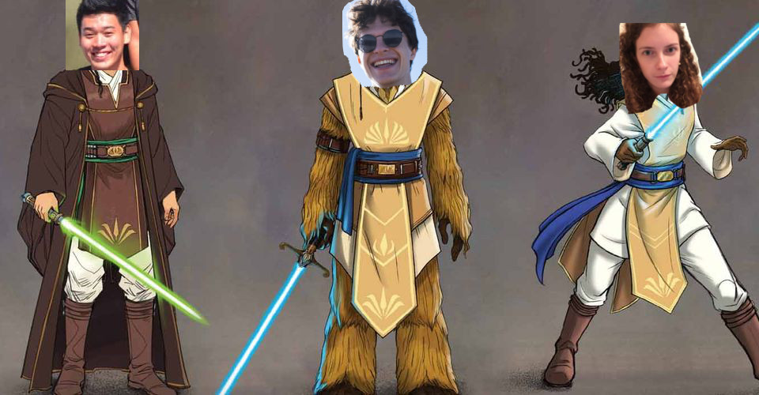

{: .mx-auto.d-block :}

We're 3 padawans, [Faustine Vigneau](https://people.epfl.ch/faustine.vigneau), [Damien Gengler](https://people.epfl.ch/damien.gengler) and [Vincent Yuan](https://people.epfl.ch/vincent.yuan) trying to decipher the power of Data Analysis at EPFL.

Our github is accessible [there](https://github.com/epfl-ada/ada-2020-project-milestone-p3-p3_p-ada-wan). We used beautifull Jekyll to produce our data story.

You can note the colors of our website are the same as the Tesco's paper ;)