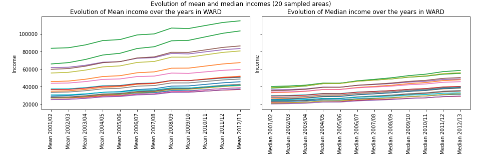
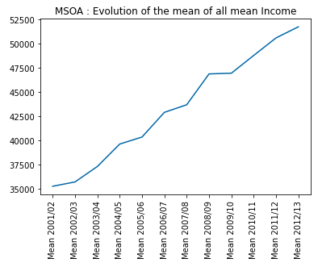
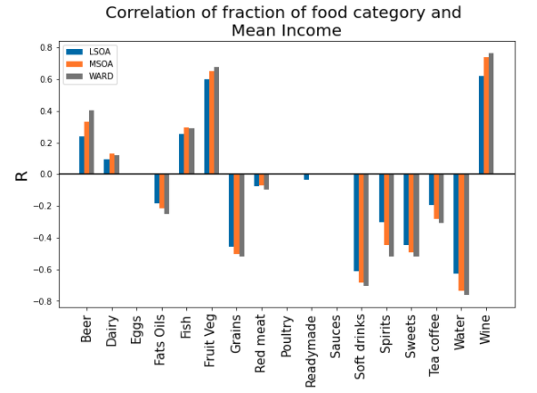
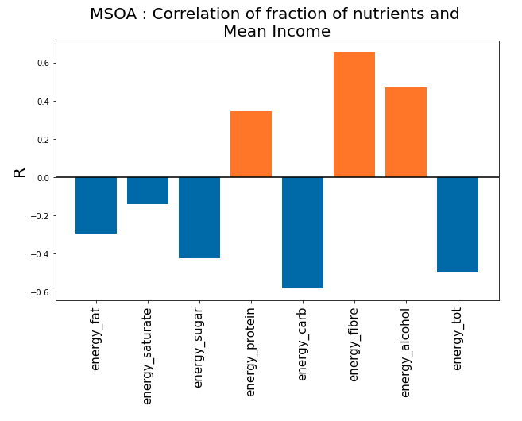
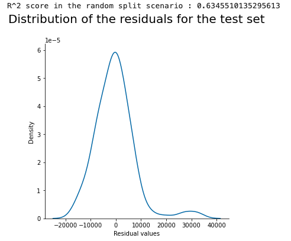
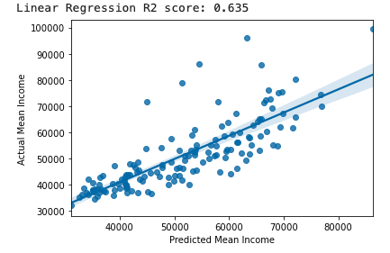

Food consumption is a very central part of human lives, by analyzing food habits we can deduce a large panel of health conditions and human behaviors. The Tesco Paper analysis focused on describing their methodology and results about Obesity and Diabetes prevalence. Throughout this data story, we will explore different aspects of the dataset by looking at the Obesity problem using the food categories first. We will then visualize the geographic repartition of food categories. Finally, we will analyze the link between food consumption and the Income per Area.

- - -

# I - Introduction to the Tesco paper 

In this first part, we'll give to the young padawans an overview of the paper [Tesco Grocery 1.0, a large-scale dataset of grocery purchases in London](https://www.nature.com/articles/s41597-020-0397-7). This paper was made by some experimented Jedi that used this dataset wisely. We tried to follow their path by extending the paper, as explained in the other blog posts.

The Tesco Grocery 1.0 dataset is a record of over 420 M food items, purchased by 1.6M fidelity card owners across Greater London. The authors aggregated the data at different levels, using the same geographical delimitations as the [Office for National statistics](https://www.ons.gov.uk/), dividing it into different granularities: LSOA (Lower Super Output Area), MSOA (Medium Super Output Area), Ward,
and borough. They computed the average food product for each area and linked it to health outcomes strongly linked to the food consumption dataset. Then, they established a correlation between the food consumed and the prevalence of health diseases in an area.

## Data aggregation

We can divide the aggregation of the Tesco dataset into two main parts.

### A link between the product and its nutrition properties

The first aggregation scheme happened for each of the 420 M food items entry. Each entry was under the form {_customer area, GTIN, timestamp_}. The **GTIN** (_Global Trade Item Number_) is used by companies to uniquely identify their trade items globally. The authors joined each entry with its corresponding nutrition informations, such as {_total energy, net weight, fats, saturated fats, carbohydrates, free sugars, proteins, fibers_}, on top of _volume_ and _relative volume of alcohol_ for drinks.

Then, they computed different data related to the nutrients informations, such as the total energy in kilocalories (_kcal_), as the dataset provides the amount of nutrients in grams (_g_). As each nutrients has a fix _g_ / _kcal_ ratio, the authors were able to compute the total amount of energy, as well as the relative amount of energy related to each nutrients.

On top of this, each food item is associated to one category. The categorization includes 17 non-overlapping classes, available in the [Appendices](#food-categories).

### An aggregation between food purchase and geographical areas

The authors mapped the purchases to geographical areas, as mentioned in the introduction. This aggregation scheme happened for all geographical levels, from LSOA to Borough. This aggregation scheme allowed the authors to have multiple granularity levels, which enable a wider range of studies that might benefit from having either a high number of smaller areas containing fewer datapoints or a lower number of areas characterized by more robust statistics.

Those areas have basic census statistics collected by the ONS in 2015. An exhaustive list of these statistics present in the joined dataset is available in the [Appendices](#geographical-areas-statistics). The authors aggregated the Tesco data relative to each area and provided 3 different sets of variables.

The first group of variables expresses the Tesco **penetration** in an area. The representativeness, which is the ratio between the number of customers in an area and the population, is computed. Normalized representativeness is also computed.

Then, the authors decided to compute the average product bought for each area. They computed multiple **nutritional properties** about this average product, such as the _weight_ or the _volume_, the _energy_, the _energy - density_, and the grams of each individual nutrient $nutrients_{i}$. Then, they compute the energy per nutrient, as well as the frequency of each nutrients, and the frequency of energy per nutrient. They managed to compute the entropy of these 2 frequencies. More details of the formulas in the [Appendices](#tesco-aggregation-formula).

The last group of variables is about the **Product categories**. The authors computed the probability distribution of items belonging to the 17 different product categories being purchased in an area a and the entropy of that distribution. They also computed the relative weight of products belonging to any category compared to the total weight and its entropy.

### Data biases and limitations

Several limitations were pointed by the authors:

+ **Representativeness**: As this study collects the grocery purchases from Tesco's customers owning a Clubcard submission, this set of Clubcard owners might not be representative of the overall population.
+ **Coverage**: The concentration of Tesco is higher in the northern part of London, thus some areas have a low penetration rate.
+ **Limited scope**: This dataset only shows the grocery purchases at Tesco - thus, the food consumption in restaurants or the food bought at other grocery stores is not included in the dataset.
+ **Average product** As the data is aggregated to create the average product consumed in an area, this is a limitation to any study that requires an average representation at an individual level rather than at a geographical level.

## Technical validation

The authors wanted to show that their aggregated dataset made sense. After a quick explanation on how to select the most representative areas, they linked their created dataset to food-related health outcomes.

### Area representativeness

To ensure the representativeness of the dataset, the authors stated that we can play with the normalized representativeness in order to select the areas with the best ratio between the number of customers and the numbers of residents.

### Validation of health outcomes

The authors joined this Tesco dataset to dataset related to obesity and Type-2 diabetes, as these health diseases are strongly correlated with diet. 

The authors computed the Spearman rank correlation between the energy, the nutrients and the nutrients entropy of the average product in an area and the prevalence of obese and overweight children and adults, as well as diabetes prevalence. Those results are displayed below. We should note that only statistically significant correlations (p < 0.05) are shown.

{: .mx-auto.d-block :}

To build stronger evidence of the link between the dataset and food-related illnesses - thus, to show that the food descriptors provided dataset are not proxies, the authors then ran an ordinary least square regression.

Using the two highest-correlated factors and four control variables accounting for demographics, they managed to get an R² ratio of 0.613, which denotes high goodness of fit. Using only the two factors _energy-carbs_ and $H_{_energy-nutrients}$, the R² ratio remained high (0.56)

These result showed that the dataset makes sense, as they found correlations which were expected between the average food product and related health diseases.

For more details about the Paper and the Data itself, the reader is invited to refer directly to the paper. 

Now that we summarized the paper, we can present the goal of our extension and analysis. 
Our first goal is to dig deeper into the analysis of the Children Obesity dataset already presented in the paper.

We will then geographically visualize the different food type consumption in London and then analyze the link with the Mean Income by area. With this we want to be able to see if given a shopping basket, we can to predict the Income of the shopper. 

- - -

# II - Children overweight prevalence

In the first part of our extension, we wanted to explore more in-depth the [Tesco Grocery dataset](https://www.nature.com/articles/s41597-020-0397-7), and especially the link between food and children overweight prevalence.

We wanted to explore deeper the papaer and establish a stronger correlation between children's overweight prevalence and food consumption. Indeed, we firstly thought that obesity among children and grocery shopping were strongly correlated.

## Introduction and expectations

We decided to explore this part of the paper as we thought that the paper didn't go in-depth enough. Indeed, the paper focused on how the authors aggregated the data rather than on establishing strong links between childhood obesity and grocery shopping. The authors computed the Spearman correlation between obese and overweight children at reception (4-5 y.o) and 6 y.o, and food consumption estimators (energy, nutrients, nutrients entropy). 

Our goal was thus to find correct predictors to produce a machine learning model that would be able to estimate overweight prevalence, given the information of an area. As we had multiple machine learning models at our disposal and more than 200 potential predictors, we thought that we could find a machine learning model that 
would predict the values correctly. 

## Our first ML benchmarking

### Choice of our predictors and target

After joining the grocery dataset with the children obesity one on the area_id, we obtained a DataFrame with 202 potential predictors and 7 labels for only 544 data points.

We had to select the correct predictors and the correct target. Indeed, our model will surely overfit with 202 predictors for a sample of size 544, and we have to focus on one target value.

The data for overweight children is more sparse than the one for obese children. Indeed, obese children are included in the overweight ones, so the overweight prevalence for children will always be greater than the obesity prevalence in the same area. That's why we chose to use overweight children as our predictor. We now had to choose between reception (4-5 y.o. children) and 6 y.o. children. We chose to select 6 y.o. children data, as they have had more time to eat and to have weight changes because of their food consumption.

As the dataset is based in London, we decided to follow the guidelines of the [National Health Service](https://www.nhs.uk/conditions/obesity/causes/)
to select our predictors. 

{: .mx-auto.d-block :}

We analyzed these guidelines and discovered that there were 4 main columns we can extract from the dataset that is potential cause to obesity: calories, fat, sugar, and alcohol. As children of 6 years old are not likely to drink alcohol, we will focus on the 3 columns _fat_, _sugar_ and _energy_tot_.

### Data preprocessing

We had to sanitize our data and preprocess it. We removed NA values, and standardize our input. We then splitthe data into a train set and a test set.

### Machine Learning Models

Our predictors, as well as our label target, are float numbers. Thus, it was a supervised Regression problem: we decided to benchmark our predictors on various ML algorithms related to the supervised regression problems. Those models are:

+ Linear regression
+ Ridge model
+ Support Vector Machine (SVM) 
+ Tree 
+ Gradient Boosted Regression (GBR)
+ ADABoost

We decided to benchmark on different models to keep the model scoring the best, and to use the [R² score](https://en.wikipedia.org/wiki/Coefficient_of_determination) to compare the different models.

### Result

Surprisingly, our results for this ML model were not good. 

{: .mx-auto.d-block :}

We can see that the R² score is always negative, which means that our models have a worst prediction than if we stated that the target value for all of our test data was always the mean of the target values. Thus, our machine learning models predict poorly the target.

## Trying out with different predictors

### New predictors, same pipeline

We tried to stick with the NHS guidelines about obesity. This time, we decided to stick with the relative amount of energy for fat and sugar instead of their absolute values in the average product. It might produce different results, and we wanted to test it out.

Our predictors for this model are _f\_energy\_sugar_, _f\_energy\_fat_ and _energy\_tot_. We decided to stick with the same target, overweight prevalence for 6 y.o. children.

After sanitizing, standardizing, and splitting the data into train and test sets, we applied our ML algorithms to it.

### Results and analysis

Again, our ML models predict poorly the target, as they all have a negative R² score. 

{: .mx-auto.d-block :}

But why do we have bad results while we follow NHS guidelines? Does that mean that we did something wrong?

We tried to analyze our result and explain why we didn't find any machine learning model fitting our data.

+ NHS warns about the number of calories eaten for obesity, but not for type-2 diabetes. It is because gaining weight is due to having more calories ingested than burnt. Thus, lacking some physical activity data might be more damageable for our study, as it is paramount in obesity analysis.
+ We have the average product for each area, but we don't know how much "average product" will be eaten by the children. As gaining weight is a matter of calories ingested, it is crucial information that we lack.
+ We analyze children's overweight prevalence but our data is the average product bought at Tesco. On top of the limitations pointed out in the Tesco paper (TODO: add a link to the tesco presentation blog, limitation section), we can add that we don't know if the children eat differently than their parents.
+ When babies are born, some of them weigh higher than others. It is a natural condition, that is "beaten" by one's diet and physical activity over time. However, by capturing overweight children prevalence at 6 y.o., maybe the children haven't lived long enough to have their eating habits changed significantly their weight.

## Using food categories

We continued to work on this dataset and we wanted to try out using food categories proportions to have a correct ML model. As we decided to focus on those food categories for the other part of our extension, it made sense to use them in this project.

After the usual data processing and splitting, we found these results: 

{: .mx-auto.d-block :}

With positive R², we have done better with this third ML model than with the 2 previous ones. We decided to perform an ordinary least squares statistical analysis. 
After discarding the non statistically significant product categories, we plotted the result with the 95% confidence interval. 

{: .mx-auto.d-block :}

These results were quite surprising. Even though it makes sense for some food categories, for example, the soft drinks, other results are in contradiction with standard food advice. For example, we find that the highest correlated food category is fish.

Instead of overinterpreting these results, we wanted to use them to give a warning about data analysis in general. It is important for a data scientist to not try to find meaning when there's none, as one can always find meaning if he desires. We'll encourage young padawans to try out the [Spurious correlations website](https://www.tylervigen.com/spurious-correlations) for examples.

In our case, even though we have statistically significant correlations between food categories and children's overweight prevalence, we don't want to state that one causes another, as we don't agree with it. 

We also learnt that our intuition about correlation might be wrong sometimes. We thought that obesity among children and grocery shopping was correlated, but it was not the case.

As we saw that food categories are more impactful than we thought, and that the paper haven't used at all the food categories, we decided to explore this part of the dataset more in depth. We will continue by visualizing the proportion of purchases for each category across London's areas.

- - -

# III - Geographical Visualization

As presented in the previous parts, we have at our disposal a huge dataset containing the food purchases made in the Tesco shops within the boundaries of London. Faced with all this data, we are a little lost and ask ourselves where to begin. And suddenly we remember that we learned, during our Padawan formation, how to become a data wizard. We take out our most beautiful tools and begin to make some visualizations to understand better our data.

We have many features available for purchases. We notice that the Tesco paper did not deeply explore the different **food categories**. Therefore, we decide to focus on these.

## What we want to visualize
We wonder if the Tesco consumers buy the same products and in the same quantity all over the city. In particular, we wonder :
- Are there some food categories that are preferred in certain regions? 
- Are there some others that are equally bought in the city? 
- Can we draw a pattern from this visualization?

To try to answer all these questions, we make plots of the distribution of a certain food category all over London. We consider a mean of the fraction of purchase of each food category in a given ward.

## Visualizations 
Each plot below represents the mean proportion of purchase of a certain food category per ward. To see all the plots, you can click on this [link](posts/2020-02-26-flake-it-till-you-make-it.md).
On top of that, by moving your mouse all over the map you can discover the exact mean proportion of purchase of a certain food category, the mean income, and the median income in each ward.



## Observations

We can notice that the distributions of the proportion of purchases for each food category are pretty different. Some food categories show uniform distributions across the areas whereas some others show very disparate distributions. 

However, there is one thing we have to note on this representation: if there is one area that has an exceptionally high proportion of a certain category, it will be hard to visualize the differences in the areas. For example, the fraction of soft drink tends to be between 2 and 5 % across the areas. However, there is one area that has a fraction of 12% of purchases of soft drinks: it shades all the other areas in the graph.

For instance, the consumption of beer seems to be the same all over the city (less than 2%), except in some outliers areas. On contrary, the consumption of meat is 6 times higher in the northern, and centered wards of London compared to some southern wards. We observe almost the same thing for the poultry.

## Interpretations

We will now try to interpret the different results. However, as we're not londoners, we don't know the stereotypes about London's areas, and we will miss some interpretations.

The consumption of ready-made meal is higher in the suburbans areas. It might be because the residents of these areas have a longer commute time - thus, they have less time to cook and buy more ready-made meals.

The consumption of meat is higher in the northern and central part of London. Meat is a pretty expensive product, and there might be a link between the mean income of an area and the meat consumption. We would not be surprised if we observe that wards with higher meat consumption are wealthier.

## A new hope 

Intrigued by these observations, we will try to see now if there exist a correlation between the income of people and the proportion of purchases of some food category in the Tesco shops.

- - -

# IV - Analysis of the link between Food category proportion and Income

We have found a dataset representing the average income for the different areas. We will link this dataset to our previous work on food categories, and discover if there's a correlation or not between food categories and income.

## Presentation of the dataset

Our data comes from the [Household Income Estimates for Small Areas](https://data.london.gov.uk/dataset/household-income-estimates-small-areas) dataset. 
This dataset presents the mean and median gross annual household income for, Lower SOAs, Middle SOAs, Wards and Boroughs, London, 2001/02 to 2012/13

We firstly want to visualize the data, in an optic to see how the mean and median income evolves between the years. 

{: .mx-auto.d-block :}

As we can see on the graph above, we can note that even though the mean and median income differs between areas, they all increases over the year. Let's aggregate the evolution of the mean of all mean Income.

{: .mx-auto.d-block :}

When taking the mean of all areas we observe a similar constant augmentation. Now that we know that there's an inflation, we decide to use the revenue for year 2012/13 as it is the closest data we have to 2015.

We will now present an interactive map to visualize the income. However, you can note that we lack data for some areas.



## Correlation studies

### Different categories 

In this part we compute the correlations between the percentage of purchase for each food category and the mean income. We performed the same analysis with the median instead of the mean, and found similar Spearman's correlation values. We thus can conduct the same analysis on both parameters, and we decided to stick with the mean as well as the Spearman's correlation for this section.

We will now present the graph showing the correlations between Food category fraction and Mean Income, for all three area-levels available. 

{: .mx-auto.d-block :}

We will first explain the meaning of these correlations. A positive correlation for a category means that areas with a greater proportion of purchase of this category tend to have a higher mean income. However, it does not mean that people with high revenues don't buy any product of a negatively correlated category: it means that the fraction of their shopping bag item belonging to that category is smaller. 

Taking the example of grains, this category being negatively correlated with income means that people with lower income overall have a bigger part of their alimentation composed of grains. 

So let's analyse these results. 
- The *negative correlation* of income with  **sweets**, **spirits**, **soft drinks**, **fats oils** and **grains** is quite interesting. It shows that poorer neighbourhoods have a higher part of the groceries dedicated to unhealthy food. The correlation with spirits is also meaningful as it might induce that poorer neighbourhood may be more prone to alcoholism or at least a higher consumption of stronger alcohol. 

- The *positive correlation* of income with **fruit and vegetables**, **fish** and **dairy** products is also interesting. We find that products we consider as heathy take a bigger part of the shopping bag in areas where the income is higher. This higher proportion of fruit and vegetables can also be explained as people with higher incomes might be more likely to be vegetarian. **Wine** is also one of those positively correlated food categories and we can explain this result, as wine being a 'fancy drink'. 

- The fraction of **water** being negatively correlated with water seems quite surprising at first but we can actually make a point by finding that tap water in poorer neighbouhoods might be of lower quality, forcing people there to buy more bottled water. People in richer neighbourhood may also be more likely to buy a water filtering system. 

- The fraction of tea and coffee being negatively correlated with income is not very meaningful, as well as the positive correlation with beer.

- We let aside the correlation that are not statistically significant or very low, namely eggs, poultry, red meat and ready-made food. Although for the latter, we can suppose that any worker is sensible to buying ready-made food for lunch thus it does not really correlates with the income. 

### Different nutrients

Even though this part was already quite developped in the original paper, we computed the correlation between mean income and nutrients. Here are the results : 

{: .mx-auto.d-block :}

 According to the World Health Organization, the three best dietetary habits to prevent heart-related conditions, strokes and diabetes are:
 - limiting the intake of calories 
 - having a nutrient-diverse diet
 - favorising the consumption of fibers and proteins over sugars, carbohydrates, and fat.

 The correlations we find with income shows that people that areas where people follow these food recommandations tend to have higher income.

## The income strikes back 

We decided to run some regression techniques to see if we can predict area's income based on the fraction of consumed food categories. 
We will show the case for MSOA as it is the middle sized and we have witnessed the same phenomena in the 3 area levels in our study. 

We will use these predictors for training as they are the one we found having a statistically significant correlation with Mean Income.
**f_beer, f_dairy, f_fats_oils, f_fish, f_fruit_veg, f_grains, f_meat_red, f_soft_drinks, f_spirits, f_sweets, f_tea_coffee, f_water and f_wine**.

We tried the same machine learning models to predict mean income than the one we used when finding children overweight. We kept 70% of our data for training, and checked how well it performs.
We found that the linear regression gave the best R-squared value, so we will continue our analysis with this method. This R-squared value being high indicates that these features predict well the mean income. 

We decided to plot the residuals to see how well our model was behaving.

{: .mx-auto.d-block :}

We find that the probability of predicting the income off by more than 10000 pounds is 0.11. This shows us that on top of being quite accurate, our regression is rarely off by more than 10000 pounds. Thus we can see that the selected food categories allow us to get a quite good prediction of the income.

To have a more visual interpretation of this regression, we plotted the predicted mean income to the actual ones.

{: .mx-auto.d-block :}

These results alongside with the correlation found above show us that we can predict, with a pretty good accuracy, the mean income of an area based on the fraction of food categories. 

- - -

# V - Conclusion 

We now summarize the findings of our extension work. 

- In the first part we used machine learning techniques to find the link between food consumption and children obesity following NHS guidelines but it did not give much results. When working with food categories we got better results. We didn't want to over interpret data as the results did not make much sense. Indeed, we were afraid to dig too much into what appeared to be a spurious correlation.   

- Next we explored our data from a geographical point of view using Chloropleths-map visualizations. We could observe that the distribution of food proportion was varying drastically for each food category and was often quite sparse. This left us wondering what could cause this sparsity.

- In the last part we looked at Mean Income over the city and found relatively flagrant correlations. Running Machine Learning techniques on our data allowed us to dig deeper into these link and train a linear regression model that allow us to predict pretty accurately the mean income. 

Overall we are quite happy with the results we find while researching our extension. We also managed to use several concepts of the course and improve our data analysis knowledge. While our analysis covered several subjects, we only explored only a small part of what was doable with the Tesco Dataset and there is still a lot of valueable information to extract from it.

# Notes 
All precise data are available in our notebook available in the [P-ADA-WAN GitHub](https://github.com/epfl-ada/ada-2020-project-milestone-p3-p3_p-ada-wan).

May the Data Force be with you ! 
